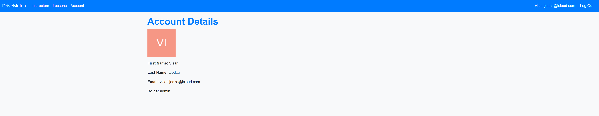
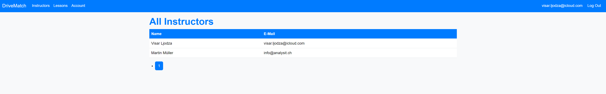
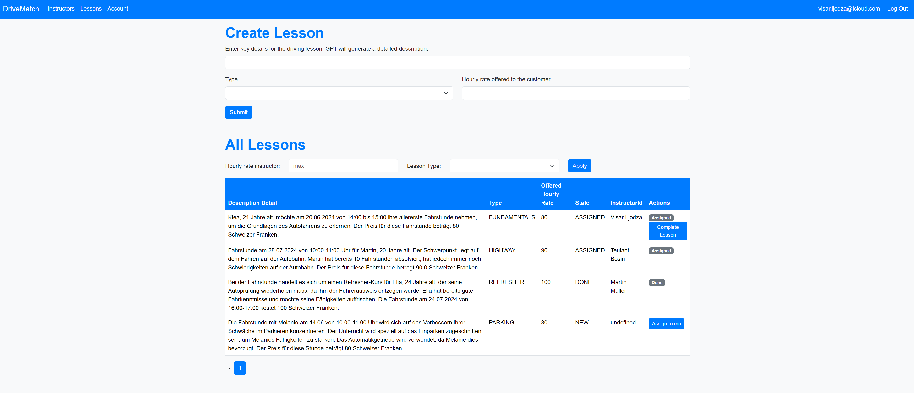
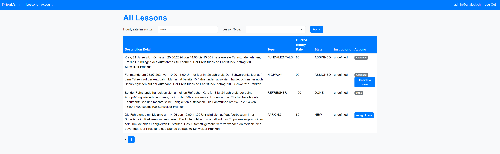

# Implementation DriveMatch

## Beschreibung des Frontends mit Screenshots der fertigen Applikation

### 1. Login-Seite

Die Login-Seite wird zur Benutzerauthentifizierung verwendet. Sie umfasst Felder für:

- **E-Mail**: E-Mail-Adresse des Benutzers.
- **Passwort**: Passwort des Benutzers.

### 2. Registrierungs-Seite

Die Anmelde-Seite ermöglicht neuen Benutzern die Registrierung. Sie umfasst Felder für:

- **E-Mail**: E-Mail-Adresse des Benutzers.
- **Vorname**: Vorname des Benutzers.
- **Nachname**: Nachname des Benutzers.
- **Passwort**: Passwort des Benutzers.

### 3. Willkommensseite

Die Willkommensseite bietet einen Überblick über die DriveMatch-Plattform, einschliesslich Funktionen und technischer Architektur:

- **Funktionen**:
  - **Gemeinsam für Benutzer (Instruktoren) und Admins (Fahrschulpersonal)**:
    - Anmeldung und Registrierung über Auth0.
    - Lektionen verwalten: Zuweisen, abschliessen, Übersicht und Filter für Lektionen.
    - Account-Seite: Anzeigen von Benutzerdetails und Rolle.

### 4. Instruktoren (Admin-Ansicht)

Die Instruktoren-Seite (Admin-Ansicht) zeigt eine Liste aller registrierten Instruktoren mit ihren Details:

- **Name**: Name des Instruktors.
- **E-Mail**: E-Mail-Adresse des Instruktors.

### 5. Lektionen (Admin-Ansicht)

Die Lektionen-Seite (Admin-Ansicht) ermöglicht Administratoren die Verwaltung von Fahrstunden. Sie umfasst:

- **Lektionen erstellen**: Formular zum Erstellen einer neuen Fahrstunde durch Eingabe der wichtigsten Details.
- **Alle Lektionen**: Liste aller Fahrstunden mit Spalten für:
  - **Beschreibung Detail**: Detaillierte Beschreibung der Lektion.
  - **Typ**: Art der Lektion (z.B. Grundlagen, Autobahn).
  - **Angebotener Stundensatz**: Angebotener Stundensatz für die Lektion.
  - **Status**: Status der Lektion (z.B. Zugewiesen, Erledigt).
  - **InstruktorId**: ID des zugewiesenen Instruktors.
  - **Aktionen**: Schaltflächen zum Abschliessen oder Zuweisen von Lektionen.

### 6. Lektionen (Benutzer-Ansicht)

Die Lektionen-Seite (Benutzer-Ansicht) ist ähnlich der Admin-Ansicht, jedoch mit eingeschränkten Aktionen. Sie umfasst:

- **Lektionen erstellen**: Formular zum Erstellen einer neuen Fahrstunde.
- **Alle Lektionen**: Liste aller Fahrstunden mit Filtern nach Stundensatz und Lektionstyp.

### 7. Account-Seite

Die Account-Seite zeigt die Benutzerinformationen, einschliesslich:

- **Vorname**: Der Vorname des Benutzers.
- **Nachname**: Der Nachname des Benutzers.
- **E-Mail**: Die E-Mail-Adresse des Benutzers.
- **Rollen**: Die Rollen des Benutzers innerhalb der Plattform (z.B. Admin).

---

## Klassendiagramm mit dem technischen Datenmodell mit Erläuterungen

### User

- **Attribute:**
  - `id: String`: Eindeutige Identifikationsnummer des Benutzers.
  - `email: String`: E-Mail-Adresse des Benutzers, wird als Login verwendet.
  - `name: String`: Vorname des Benutzers.
  - `lastname: String`: Nachname des Benutzers.
- **Methoden:**
  - `Instructor()`: Konstruktor ohne Parameter.
  - `Instructor(email, name, lastname)`: Konstruktor mit Parametern, initialisiert einen neuen Benutzer.
  - Getter und Setter für alle Attribute.

### Lesson

- **Attribute:**
  - `id: String`: Eindeutige Identifikationsnummer der Fahrstunde.
  - `description: String`: Beschreibung der Fahrstunde.
  - `price: Double`: Preis der Fahrstunde.
  - `lessonType: LessonType`: Typ der Fahrstunde, definiert als Enumeration.
  - `lessonState: LessonState`: Status der Fahrstunde, definiert als Enumeration.
  - `instructor_id: String`: Referenz auf den `User`, der die Fahrstunde leitet oder zugewiesen ist.
- **Methoden:**
  - `Lesson()`: Standardkonstruktor.
  - `Lesson(description, price, lessonType, lessonState, instructor_id)`: Konstruktor mit Parametern zur Initialisierung einer Fahrstunde.
  - Getter und Setter für alle Attribute.

### Enumerations

#### LessonType

- Definiert mögliche Typen von Fahrstunden wie `BEGINNER`, `INTERMEDIATE`, `ADVGANCED`, `FUNDAMENTALS`, `URBAN`, `HIGHWAY`, `REFRESHER` und `PARKING`.

#### LessonState

- Definiert mögliche Zustände einer Fahrstunde, einschliesslich `NEW`, `ASSIGNED`, und `DONE`.

### DTOs

#### LessonCreateDTO

- **Attribute:**
  - `description: String`: Beschreibung der Fahrstunde.
  - `price: Double`: Preis der Fahrstunde.
  - `lessonType: LessonType`: Typ der Fahrstunde.
- **Methoden:**
  - `LessonCreateDTO()`: Konstruktor ohne Parameter.

## Beziehungen

- **User zu Lesson**:
  - Ein `User` kann mehrere `Lesson`-Objekte zugeordnet haben (0..*), was die Möglichkeit reflektiert, dass ein Fahrlehrer mehrere Fahrstunden leiten kann.

---

## Aufgaben und Funktionen eingebundener Drittsysteme

### Auth0

**Aufgabe:** Authentifizierung und Autorisierung

**Funktionalitäten:**

- **Registrierung und Anmeldung:** Auth0 wird verwendet, um Benutzer zu registrieren und zu authentifizieren. Dies beinhaltet die Verwaltung von Benutzerkonten und die Bereitstellung sicherer Anmeldeverfahren.
- **Rollenverwaltung:** Auth0 ermöglicht die Zuweisung von Rollen an Benutzer (z.B. Admin), um unterschiedliche Berechtigungen und Zugriffsrechte zu verwalten.
- **Token-Generierung:** Auth0 erstellt und verwaltet JWTs (JSON Web Tokens), die zur Authentifizierung von API-Anfragen verwendet werden.

### Disify API

**Aufgabe:** E-Mail-Validierung

**Funktionalitäten:**

- **E-Mail-Formatprüfung:** Disify überprüft, ob die eingegebene E-Mail-Adresse das richtige Format hat.
- **Domain-Validierung:** Disify stellt sicher, dass die Domain der E-Mail-Adresse existiert und gültig ist.
- **Überprüfung auf Wegwerf-E-Mails:** Disify erkennt und filtert Wegwerf-E-Mail-Adressen heraus, um die Qualität der Benutzerregistrierungen zu gewährleisten.

### GPT API

**Aufgabe:** Generierung von detaillierten Fahrstundenbeschreibungen

**Funktionalitäten:**

- **Textgenerierung:** GPT API verwendet maschinelles Lernen, um auf Basis von Schlüsselwörtern und Grundinformationen detaillierte und ansprechende Fahrstundenbeschreibungen zu erstellen.
- **Automatisierte Inhalte:** Die API ermöglicht es, konsistente und qualitativ hochwertige Beschreibungen für Fahrstunden automatisch zu generieren, was die Erstellung neuer Fahrstunden vereinfacht und beschleunigt.

### SonarCloud

**Aufgabe:** Code-Analyse und Qualitätssicherung

**Funktionalitäten:**

- **Statische Code-Analyse:** SonarCloud analysiert den Code auf potenzielle Fehler, Sicherheitslücken und Code-Smells.
- **Qualitätsmetriken:** Das Tool bietet eine Übersicht über verschiedene Qualitätsmetriken wie technische Schulden, Code-Abdeckung durch Tests und Komplexität.
- **Automatisierte Berichte:** SonarCloud generiert regelmässig Berichte und Dashboards, die den aktuellen Zustand des Codes und dessen Qualität darstellen.

### Cypress

**Aufgabe:** End-to-End-Testing

**Funktionalitäten:**

- **Automatisierte Tests:** Cypress führt automatisierte Tests durch, um sicherzustellen, dass alle Funktionalitäten der Plattform wie erwartet funktionieren.
- **Testberichte:** Das Tool erstellt ausführliche Testberichte, die zeigen, welche Tests erfolgreich waren und welche fehlgeschlagen sind.
- **Debugging:** Cypress bietet umfangreiche Debugging-Möglichkeiten, um Fehler schnell zu identifizieren und zu beheben.